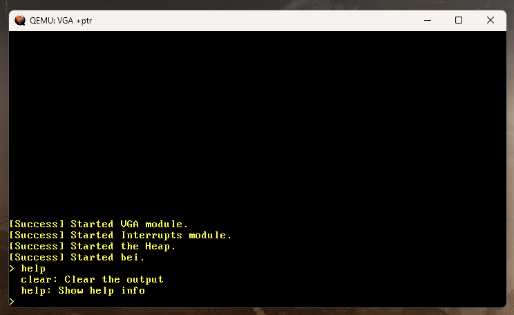

# bei - a toy OS 🦀

Bei is a **toy OS** written in Rust 🦀. Made by following [Philipp Oppermann's blog](https://os.phil-opp.com/).



### Usage
```
# Install QEMU
rustup component add llvm-tools-preview
cargo install bootimage
cargo build
cargo bootimage
cargo test --package bei
cargo run
```